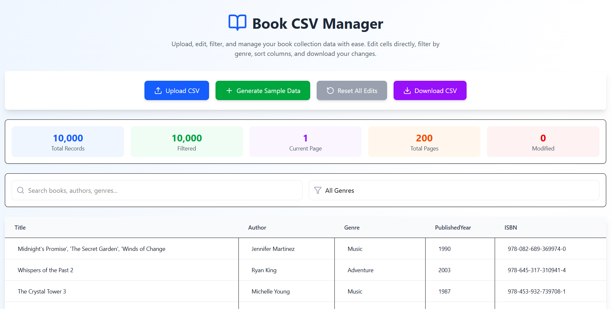
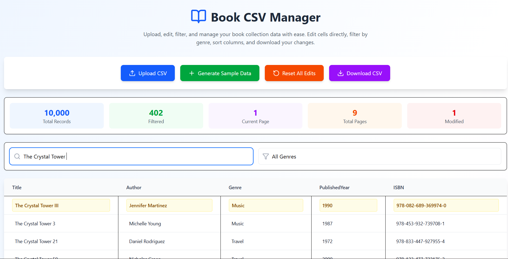
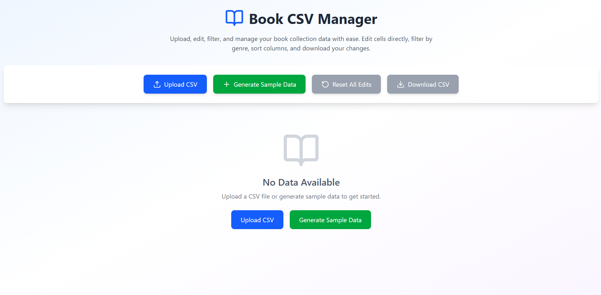

# Book CSV Manager 📚

A comprehensive React web application for managing large CSV datasets containing book information. Features include uploading CSV files, inline editing, filtering, sorting, and exporting modified data.

## ✨ Features

### Core Functionality
- 📤 **CSV Upload**: Upload large CSV files (10,000+ rows supported)
- 🎲 **Sample Data Generation**: Generate fake book data using built-in data generator
- ✏️ **Inline Editing**: Click any cell to edit directly in the table
- 🔍 **Advanced Filtering**: Search across all fields and filter by genre
- 📊 **Column Sorting**: Sort by any column (ascending/descending)
- 📥 **CSV Export**: Download edited data as a new CSV file
- 🔄 **Reset Functionality**: Revert all changes to original data

### User Experience
- 📱 **Responsive Design**: Mobile and tablet friendly
- 🎨 **Modern UI**: Clean, attractive interface with smooth animations
- 📈 **Real-time Statistics**: Live counts of total, filtered, and modified records
- 🏷️ **Visual Indicators**: Highlighted modified cells and rows
- ⚡ **Performance Optimized**: Efficient pagination and data handling
- 🔔 **Loading Feedback**: Progress indicators for data operations

## 🚀 Getting Started

### Prerequisites
- Node.js 16+ 
- npm or yarn
- Modern web browser

### Installation

1. **Clone or copy the code**
   ```bash
   # If using as a standalone file
   mkdir book-csv-manager
   cd book-csv-manager
   ```

2. **Install dependencies**
   ```bash
   npm install
   ```

3. **Run the application**
   ```bash
   npm run dev
   ```

## 📊 Expected CSV Format

The application expects CSV files with the following columns:

```csv
Title,Author,Genre,PublishedYear,ISBN
"The Great Gatsby","F. Scott Fitzgerald","Literary Fiction","1925","978-0-7432-7356-5"
"To Kill a Mockingbird","Harper Lee","Literary Fiction","1960","978-0-06-112008-4"
"1984","George Orwell","Dystopian Fiction","1949","978-0-452-28423-4"
```

### Column Definitions
- **Title**: Book title (string)
- **Author**: Author name (string) 
- **Genre**: Book genre/category (string)
- **PublishedYear**: Year of publication (string/number)
- **ISBN**: International Standard Book Number (string)

## 🎯 How to Use

### 1. Loading Data
**Option A: Upload CSV File**
- Click "Upload CSV" button
- Select your CSV file (should contain book data)
- Wait for processing (progress indicator will show)

**Option B: Generate Sample Data**
- Click "Generate Sample Data" button
- Application will create 10,000 fake book records
- Perfect for testing and demonstration

### 2. Viewing Data
- Data is displayed in a paginated table (50 rows per page)
- Navigate using pagination controls at the bottom
- View statistics in the top summary bar

### 3. Filtering & Searching
**Search:**
- Use the search bar to find records across all fields
- Search is case-insensitive and matches partial text

**Filter by Genre:**
- Use the genre dropdown to filter by specific genres
- Shows only books matching the selected genre

### 4. Sorting Data
- Click any column header to sort by that column
- Click again to reverse sort order
- Sort indicators (↑↓) show current sort direction

### 5. Editing Records
- Click any cell to enter edit mode
- Type new value and press Enter or click ✓ to save
- Click ✗ to cancel editing
- Modified cells are highlighted in yellow
- Modified row count appears in statistics

### 6. Managing Changes
**Reset All Edits:**
- Click "Reset All Edits" to revert all changes
- Returns data to original uploaded state
- Button is disabled when no changes exist

**Download Modified Data:**
- Click "Download CSV" to export current data
- Downloads as "books_edited.csv"
- Includes all modifications made


### Key Technologies
- **React**: Frontend framework with hooks
- **PapaParse**: CSV parsing and generation
- **Lucide React**: Icon library

## 📸 Screenshot



